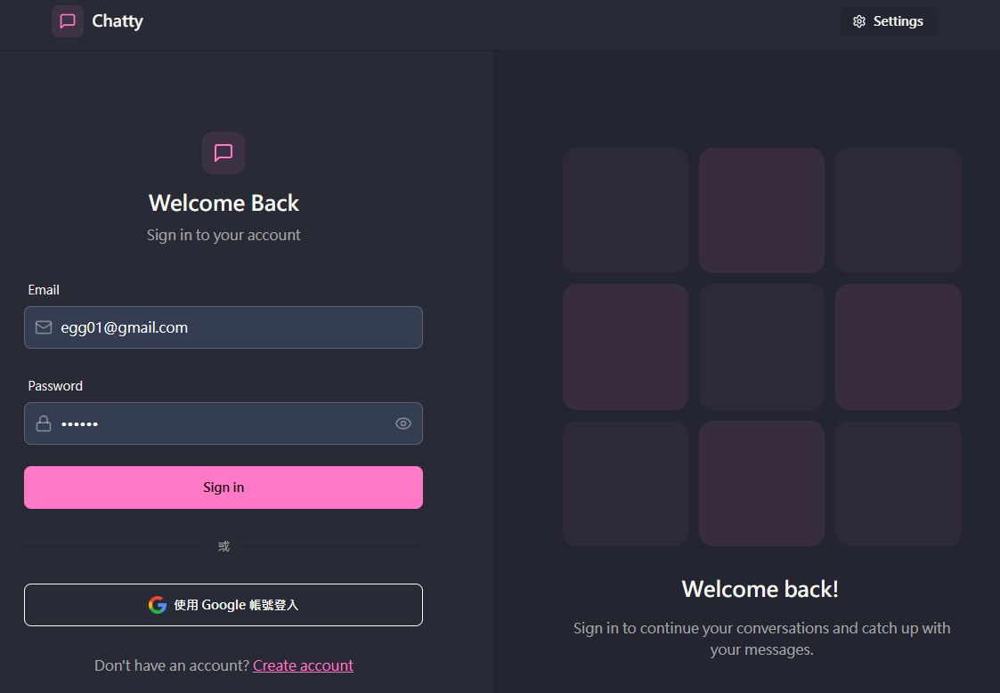

# 即時聊天應用程式
一個功能豐富的全端即時聊天應用程式，採用NERM架構開發全端。




[](https://nodejs.org/)
[](https://reactjs.org/)
[](https://socket.io/)
[](https://www.mongodb.com/)
[](LICENSE)


這是一個使用 React 和 Node.js 建構的全端即時聊天應用程式，支援即時訊息傳遞、Google OAuth 登入、圖片上傳等豐富功能。

## 功能特色

### 核心功能
- **多重登入方式**
  - 傳統郵件/密碼註冊登入
  - Google OAuth 2.0 一鍵登入
- **即時通訊**
  - 即時訊息傳遞
  - 訊息已讀狀態追蹤
  - 聊天室進入/離開通知
- **使用者互動**
  - 線上狀態指示（online/offline/active）
  - 使用者個人資料設定
  - 頭像上傳與自訂
- **多媒體支援**
  - 圖片訊息上傳
  - Cloudinary 雲端儲存
- **使用者體驗**
  - 深色/淺色主題切換
  - 移動裝置響應式設計

### 系統特色
- **高效能**：Socket.IO 提供低延遲即時通訊
- **安全性**：JWT 認證 + BCrypt 密碼加密
- **跨平台**：PWA 支援，支援各種裝置

## 技術棧

### 前端 (Frontend)
| 技術 | 版本 | 用途 |
|------|------|------|
| **React** | 18.3.1 | 使用者介面函式庫 |
| **Vite** | Latest | 快速建構工具與開發伺服器 |
| **Zustand** | 5.0.1 | 輕量級狀態管理 |
| **React Router** | 6.28.0 | 單頁應用路由 |
| **Socket.IO Client** | 4.8.1 | 即時通訊客戶端 |
| **Axios** | 1.7.7 | HTTP 請求處理 |
| **TailwindCSS** | Latest | 實用程式優先的 CSS 框架 |
| **DaisyUI** | 4.12.14 | TailwindCSS 元件庫 |
| **React Hot Toast** | 2.4.1 | 優雅的通知提示 |
| **Lucide React** | 0.459.0 | 現代化圖示庫 |

### 後端 (Backend)
| 技術 | 版本 | 用途 |
|------|------|------|
| **Node.js** | 18+ | JavaScript 執行環境 |
| **Express** | 4.21.1 | Web 應用程式框架 |
| **Socket.IO** | 4.8.1 | 即時雙向通訊 |
| **MongoDB** | Latest | NoSQL 文件資料庫 |
| **Mongoose** | 8.8.1 | MongoDB 物件文件映射 |
| **JWT** | 9.0.2 | JSON Web Token 認證 |
| **BCrypt** | 2.4.3 | 密碼雜湊加密 |
| **Passport** | 0.7.0 | 認證中介軟體 |
| **Cloudinary** | 2.5.1 | 雲端圖片儲存服務 |
| **CORS** | 2.8.5 | 跨來源資源共享 |

### 開發工具
- **Nodemon** - 開發環境自動重啟
- **ESLint** - 程式碼品質檢查


### 系統架構圖

```
                    即時聊天應用程式架構
    
前端 (React + Vite)          後端 (Node.js + Express)
┌─────────────────┐         ┌─────────────────────────┐
│                 │         │                         │
│  React 元件     │◄────────┤  Express 路由            │
│  • 聊天介面     │  HTTP   │  • 認證路由              │
│  • 使用者管理   │  AJAX   │  • 訊息路由              │
│  • 狀態管理     │         │                         │
│                 │         │  中介軟體               │
│  Socket.IO      │◄────────┤  • JWT 認證             │
│  客戶端         │ WebSocket│  • CORS 設定            │
└─────────────────┘         └─────────────────────────┘
         │                              │
         │                              │
         ▼                              ▼
┌─────────────────┐         ┌─────────────────────────┐
│                 │         │                         │
│  瀏覽器本地      │         │  MongoDB 資料庫         │
│  儲存           │         │  • 使用者資料            │
│  • JWT Token    │         │  • 聊天訊息              │
│  • 主題設定      │         │                         │
└─────────────────┘         └─────────────────────────┘
                                        │
                                        ▼
                            ┌─────────────────────────┐
                            │                         │
                            │  Cloudinary 雲端服務     │
                            │  • 圖片儲存              │
                            │                         │
                            └─────────────────────────┘
```


## 核心功能詳解

### 認證系統

#### 傳統登入
- 使用者註冊（姓名、郵件、密碼）
- 安全登入與登出
- BCrypt 密碼雜湊加密
- JWT Token 身分驗證

#### Google OAuth 2.0
- 一鍵 Google 帳號登入
- 支援頭像自動匯入

### 即時通訊系統

#### 訊息功能
- **即時傳送**：使用 Socket.IO 實現零延遲訊息傳遞
- **多媒體支援**：文字訊息 + 圖片分享
- **已讀回執**：即時顯示訊息讀取狀態
- **聊天歷史**：完整的對話記錄保存

#### 狀態追蹤
應用程式支援三種使用者狀態：
- **Online**：雙方都在同一聊天室中
- **Active**：對方在線但不在當前聊天室
- **Offline**：對方不在線

#### 聊天室功能
- **進入/離開通知**：當使用者進入或離開聊天室時顯示系統通知
- **訊息自動標記已讀**：當雙方都在聊天室時自動標記訊息為已讀
- **即時狀態同步**：所有使用者狀態變化即時同步

### 使用者管理

#### 個人資料
- 頭像上傳（整合 Cloudinary）
- 帳號設定管理

#### 好友系統
- 使用者列表瀏覽
- 線上狀態顯示
- 聊天對象選擇

### 使用者介面

#### 主題系統
- 淺色主題
- 深色主題
- 自動主題記憶

#### 響應式設計
- 手機優化介面
- 桌面完整體驗
- 平板

### 技術特色

#### Socket.IO 整合
- 訊息即時傳遞
- 使用者狀態同步
- 聊天室進入/離開事件
- 已讀狀態通知

#### 安全性措施
- JWT Token 認證
- HTTP-Only Cookies
- CORS 保護
- 密碼加密儲存
- XSS 防護

## 特別功能說明

### 聊天狀態追蹤

應用程式會追蹤三種聊天狀態：
- `connect` - 雙方都在同一聊天室中
- `active` - 對方在線但未在當前聊天室
- `offline` - 對方不在線

### 訊息讀取確認

當雙方都在同一聊天室時，訊息會自動標記為已讀。系統會即時通知發送者其訊息已被讀取。

### Socket.IO 使用說明

應用程式使用 Socket.IO 實現以下功能：
- 即時訊息傳遞
- 線上狀態同步
- 聊天狀態追蹤
- 已讀狀態通知

### 聊天室進入/離開通知

聊天應用程式現在支援聊天室進入與離開通知：
- 當一個使用者進入聊天室，而另一個使用者已經在該聊天室時，系統會顯示進入通知
- 當使用者離開聊天室時，系統會向聊天室中的其他使用者顯示離開通知
- 通知訊息會以系統訊息的形式顯示在聊天界面中


## 快速開始

### 前置需求

確保你的系統已安裝以下工具：
- [Node.js](https://nodejs.org/) (v18 或更新版本)
- [MongoDB](https://www.mongodb.com/) (本地安裝或 MongoDB Atlas)
- [Git](https://git-scm.com/)

### 環境設定

#### 1. 複製專案

```bash
git clone <your-repository-url>
cd CHAT-APP
```

#### 2. 安裝所有依賴

```bash
# 一鍵安裝前端、後端所有依賴
npm run install-all

# 或者分別安裝
npm install                    # 根目錄依賴
cd frontend && npm install     # 前端依賴
cd ../backend && npm install   # 後端依賴
```

#### 3. 環境變數設定

**後端環境變數** (`backend/.env`)：
```env
# 伺服器設定
PORT=3000
NODE_ENV=development

# 資料庫設定
MONGO_URI=mongodb://localhost:27017/chatapp
# 或使用 MongoDB Atlas

# JWT 設定
JWT_SECRET=your-super-secret-jwt-key

# Cloudinary 設定 (圖片上傳)
CLOUDINARY_CLOUD_NAME=your_cloud_name
CLOUDINARY_API_KEY=your_api_key
CLOUDINARY_API_SECRET=your_api_secret

# Google OAuth 設定
GOOGLE_CLIENT_ID=your_google_client_id
GOOGLE_CLIENT_SECRET=your_google_client_secret

# Session 設定
SESSION_SECRET=your-session-secret

# 前端 URL 設定
FRONTEND_URL=http://localhost:5173
DEV_FRONTEND_URL=http://localhost:5173
BACKEND_URL=http://localhost:3000
```

**前端環境變數** (`frontend/.env`)：
```env
# API 基礎 URL
VITE_API_BASE_URL=http://localhost:3000

# 應用版本
VITE_VERSION=1.0.0
```

#### 4. Google OAuth 設定 (可選)

1. 前往 [Google Cloud Console](https://console.cloud.google.com/)
2. 創建新專案或選擇現有專案
3. 啟用 Google+ API
4. 創建 OAuth 2.0 憑證
5. 設定授權重定向 URI：
   - `http://localhost:3000/api/auth/google/callback`
6. 設定授權 JavaScript 來源：
   - `http://localhost:3000`
   - `http://localhost:5173`

### 執行應用程式

#### 開發環境

```bash
# 同時啟動前端和後端 (推薦)
npm run dev

# 或者分別啟動
npm run dev:backend    # 啟動後端 (localhost:3000)
npm run dev:frontend   # 啟動前端 (localhost:5173)
```

#### 生產環境

```bash
# 建構所有檔案
npm run build

# 啟動生產伺服器
npm start
```

#### 其他指令

```bash
npm run clean          # 清除建構檔案
npm test              # 執行測試 (目前無測試)
```

### 開啟應用程式

開發環境啟動後，前往以下網址：
- **前端應用程式**: http://localhost:5173
- **後端 API**: http://localhost:3000
